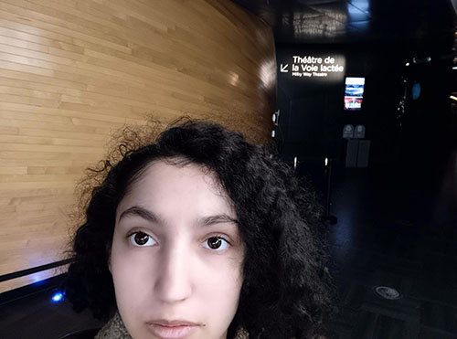

<h2>Planétarium</h2>

<h2>Lieu de l'exposition</h2>
 

<h2>Type d'exposition</h2>
C'est une exposition temporaire et intérieur.

<h2>Date de ma visite</h2>
 .

<h2>Titre du dispositive</h2>
Echomarine

<h2>Nom des artiste</h2>

<h2>Année de réalisation</h2>
2023

<h2>Description du dispositif</h2>

<h2>Type d'installation </h2>
Ces une installation interactive et immersive

<h2>Fonction du dispositif </h2>

<h2>Mise en espace</h2>
Le dispositive est installé dans le petit studio, le visuel est difuser grace a des projecteur sur tout les mur de la piece sauf le mur de ou se trouve la porte. L'ardinateur qui permet d'activer l'animation se trouve sur une petite table au milieu de la piéce.

<h2>Composantes et techniques</h2>
-animation des animaux et de la mer
-site web 
-dessin des animaux du site

<h2>Éléments nécessaires</h2>
-haut parleur
-projecteur
-cables
-ordinateur 

<h2>Expérience vécue</h2>
Le visiteur doivent etre quatre et se placer devant les les quatre capteur disposer sur le grand poteaux au milieu du cercle de poteaux qu'il y a. Lorsque chaqu'un des quatre visiteur se sera positionner devant un capteur les lumieur ferais un chema d'allumage et de couleur différent d'avant l'activations avec une musique plus dinamique et différente que la musique d'avant. Lorsque j'ai essayer l'oeuvre j'ai activé avec trois autre personne l'interractiviter et cela ma agréablement surpris j'ai adoré tout particulierement la musique entrenante qui avais suivis l'activation et qui me donnais envhie de danser.

<h2>Ce que j'ai aimé</h2>
J'ai aimé dans se projet interactive particuliairement La facilite de compression du fonctionnement de l'activiter pour etre plus precis le faite qu'on rentre dans une piece avec des décore maritine animé et qu'il si trouve au milieu un ordinateur possé en hauteur sur une table avec un page web facile a comprendre garce au faite qu'il y a sur la page juste des rend avec un animal marin différent dans chaque rend. L'ordinateur possé au milieu permet de comprendre que cet ordi est pour l'utilisation des visiteur. Cette disposition claire de comment l'activiter marche me rappele que sa peut etre frustant de mal comprendre comment fonctionne une activiter et que en peut penser qu'elle ne fonctionne pas cela mets un poind sur la trés bonne disposition au quel j'aimerais m'inspirer pour mes futures projet.

<h2>Mauvais aspect</h2>x
Ce que je n'est pas aimé dans Échomarine c'est son animation de fond de ses animeaux marin car l'animation de fond ne change pas dépandament de l'animal marin que ta choisis se qui donne l"impression ne rester sur place et cela enléve l'impression d'immerser dans la faune qu'ons nous présente .
